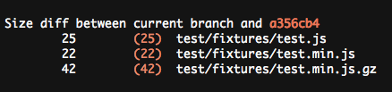

# grunt-sizediff

> Diff file sizes between current git branch and a branch/commit.<br>
> Helps you keep an eye on your project size changes.




## Install

```
$ npm install --save-dev grunt-sizediff
```


## Usage

```js
require('load-grunt-tasks')(grunt); // npm install --save-dev load-grunt-tasks

grunt.initConfig({
	sizediff: {
		dist: {
			src: [
				'file.js',
				'file.min.js' // optional
			]
		}
	}
});

grunt.registerTask('default', ['sizediff']);
```

You can specify two files to diff and an optional target. It falls back to `master` if `target` is not specified.

#### Diff against a branch

```js
sizediff: {
	dist: {
		options: {
			target: 'future' // branch
		},
		src: [
			'file.js',
			'file.min.js'
		]
	}
}
```

#### Diff against a commit

```js
sizediff: {
	dist: {
		options: {
			target: 'fd9b092' // commit
		},
		src: [
			'file.js',
			'file.min.js'
		]
	}
}
```


## Override target

You can temporarily override the diff target of a task by running `grunt sizediff:dist:target`, where `dist` is the task target you want to override and `target` is the branch or commit.


## License

MIT © [Sindre Sorhus](https://sindresorhus.com)
